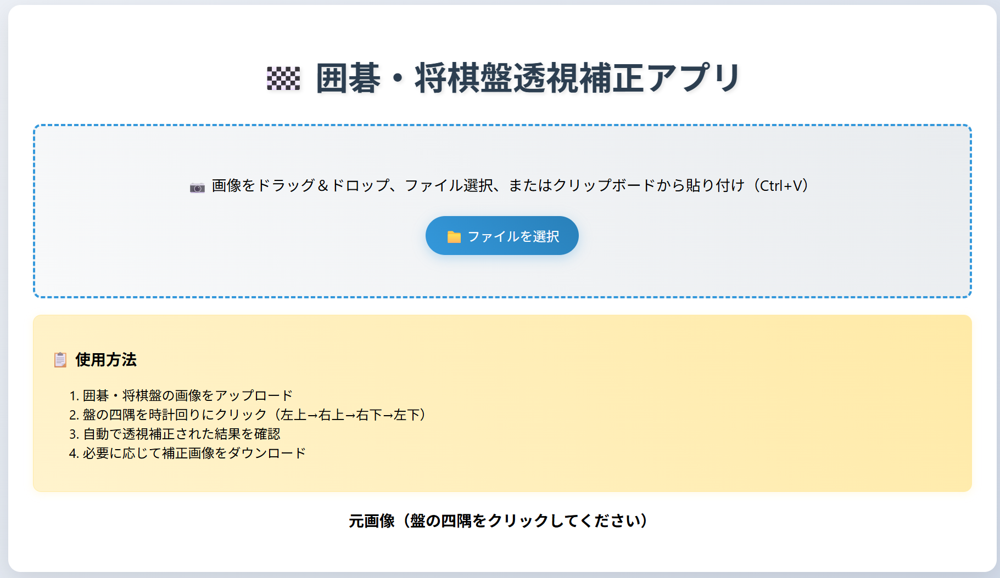
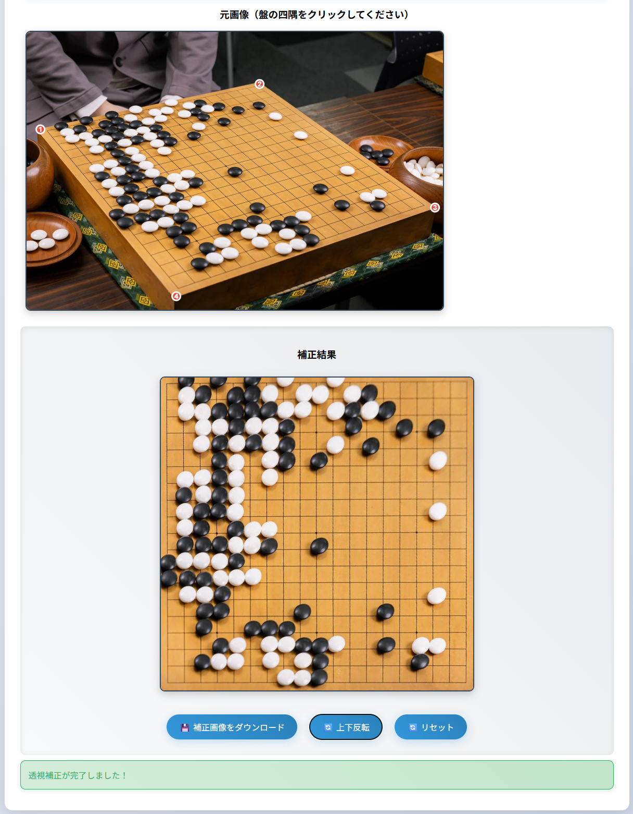

# 囲碁・将棋盤透視補正アプリ

斜めから撮影された囲碁・将棋盤の画像を、真上から見下ろしたような正方形に透視補正するWebアプリケーションです。

## 概要

このアプリは、スマートフォンやカメラで斜めから撮影した囲碁・将棋盤の写真を、まっすぐ真上から見たような画像に変換します。何かに使えるかもしれません。

以下は初期画面と補正後の結果画面の例です。

| 初期画面 | 結果画面 |
|:---:|:---:|
|  |  |

## 主な機能

### 📷 画像入力
- ファイル選択による画像アップロード
- ドラッグ&ドロップによる画像読み込み
- クリップボードからの画像貼り付け（Ctrl+V）

### 🎯 透視補正
- 4点クリックによる盤の四隅指定（時計回りに左上→右上→右下→左下）
- 自動透視変換による画像補正
- 高品質なバイリニア補間を使用した画像処理

### 🔄 表示機能
- 180度回転（点対称変換）による相手視点表示
- 先手・後手、黒番・白番の視点切り替え
- リアルタイムプレビュー

### 💾 出力機能
- 補正済み画像のPNG形式ダウンロード
- 高解像度出力対応

## 仕様

### 対応画像形式
- JPEG
- PNG
- WebP
- その他ブラウザ対応画像形式

### 出力仕様
- **出力サイズ**: 600×600ピクセル（正方形）
- **出力形式**: PNG
- **画質**: ロスレス高品質

### 技術仕様
- **フロントエンド**: HTML5 Canvas API + JavaScript
- **画像処理**: Canvas 2D Context
- **透視変換**: 4点対応による射影変換行列計算
- **補間方式**: バイリニア補間
- **ブラウザ要件**: HTML5 Canvas対応ブラウザ

### 変換アルゴリズム
1. **4点対応による変換行列計算**: ユーザー指定の4点から射影変換行列を算出
2. **逆変換による画素マッピング**: 出力画像の各ピクセルに対応する入力画像座標を逆算
3. **バイリニア補間**: 非整数座標に対する滑らかな画素値補間
4. **高品質レンダリング**: エイリアシング抑制による鮮明な出力

## 対応盤面

- **囲碁盤**: 19路盤、13路盤、9路盤など
- **将棋盤**: 9×9の標準将棋盤
- **その他**: 格子状の盤面全般

## 使用方法

1. 囲碁・将棋盤の画像をアップロード
2. 盤の四隅を時計回りの順番でクリック指定
3. 自動的に透視補正が実行される
4. 必要に応じて180度回転で相手視点に切り替え
5. 補正済み画像をダウンロード

## ライセンス

MIT License
